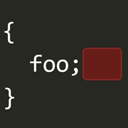

<figure>

  

  <figcaption>Photo by <a href="https://unsplash.com/@hudsoncrafted" target="_blank" rel="noopener noreferrer">Debby Hudson</a> on <a href="https://unsplash.com/" target="_blank" rel="noopener noreferrer">Unsplash</a></figcaption>
</figure>

Vanilla VS Code is dull. I looked for extensions to personalize the appearance and found some to be helpful. I curated them for you to try.

## Bracket Pair Colorizer

<figure>

  

  <figcaption>Bracket Pair Colorizer (source: <a href="https://marketplace.visualstudio.com/items?itemName=CoenraadS.bracket-pair-colorizers" target="_blank" rel="noopener noreferrer">Visual Studio Marketplace</a>)</figcaption>
</figure>

Turn your plain brackets to be more readable! This extension makes them colored and shows a thin line of their scope. It also tells you when you have an unpaired bracket. Version 2 is now available but I stick with the older one because I don't have any issue up until now. Install [here](https://marketplace.visualstudio.com/items?itemName=CoenraadS.bracket-pair-colorizers).

## indent-rainbow

<figure>

  

  <figcaption>indent-rainbow (source: <a href="https://marketplace.visualstudio.com/items?itemName=oderwat.indent-rainbow" target="_blank" rel="noopener noreferrer">Visual Studio Marketplace</a>)</figcaption>
</figure>

indent-rainbow gives the indentation four different colors on each step, depends on your tab size. Install [here](https://marketplace.visualstudio.com/items?itemName=oderwat.indent-rainbow).

## Indented Block Highlighting

<figure>

  

  <figcaption>Indented Block Highlighting (source: <a href="https://marketplace.visualstudio.com/items?itemName=byi8220.indented-block-highlighting" target="_blank" rel="noopener noreferrer">Visual Studio Marketplace</a>)</figcaption>
</figure>

I use this as a support for bracket colorizer. It highlights the area where the cursor is. Install [here](https://marketplace.visualstudio.com/items?itemName=byi8220.indented-block-highlighting).

## Trailing Spaces

<figure>

  

  <figcaption>Trailing Spaces (source: <a href="https://marketplace.visualstudio.com/items?itemName=shardulm94.trailing-spaces" target="_blank" rel="noopener noreferrer">Visual Studio Marketplace</a>)</figcaption>
</figure>

Seeing whitespace left disregarded sometimes itches me. This extension highlights and removes it with a shortcut which results in cleaner code. Install [here](https://marketplace.visualstudio.com/items?itemName=shardulm94.trailing-spaces).

## United Ubuntu Theme (from *Linux Themes for VS Code*)

<figure>

  

  <figcaption>United Ubuntu Theme</figcaption>
</figure>

I've used this theme since the early days of using VS Code and haven't switched to anything else since. It is vibrant and contrastive.

***

There are also some additionals I'd like to suggest on VS Code preferences settings:

1. I set `Render Whitespace` to `boundary` to show faded dots representing whitespace
2. I set `Tab Size` to `2`. The default value `4` consumes too much width and not suitable for vertically-split editors.
3. I use Monaco typeface. Originally from macOS, Monaco is not too thin and has simpler lowercase "a" and "g" derived from *Chancery hand* and *Blackletter* respectively[^1]. We read code, not newspapers.

<figure>

  

  <figcaption>Specimen of the typeface Monaco (source: <a href="https://en.wikipedia.org/wiki/Monaco_(typeface)" target="_blank" rel="noopener noreferrer">Wikipedia</a>)</figcaption>
</figure>

[^1]: Quora, ***Why are there two ways to write the lower case letters ‘A’ and ’G’?*** \[website\], https://www.quora.com/Why-are-there-two-ways-to-write-the-lower-case-letters-A-and-G, (accessed June 6 2020)