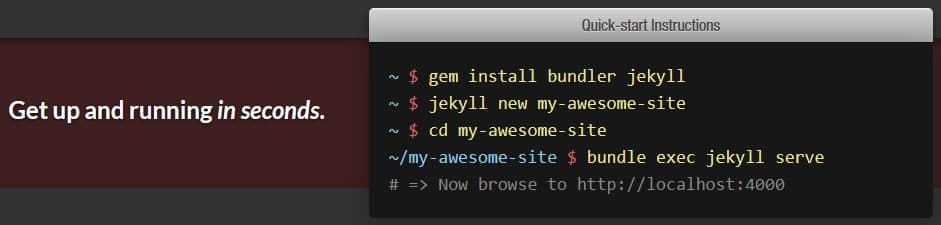

Hello! This is my very first blog post...

...built on Jekyll.

In November 2018, I taught myself how to build a website. When I was looking for a free platform to publish it, I found this static site generator.

<figure>

  

  <figcaption>Jekyll's quick start instructions.</figcaption>
</figure>

>How the hell do I run it? What is "gem"?

Pretty much that was my first impression. Even though the site said "simple", I didn't think it was. A **big no** for me. Then I found [Github Pages](https://pages.github.com/) and stayed with it.

It was long until recently I wanted to write again (pst, I used to be a blogger on [Linkin Park Indonesia](http://lpiblogsite.blogspot.com/)). I visited Jekyll yesterday and wow! Things got simpler after I graduated from a coding bootcamp. Now I know what those commands mean. Written in Ruby, `gem` is like `node`, and `Gemfile` is like `package.json` in Javascript.

There are so many cool templates but I picked Noir and tweaked it a little bit. Minimalist, well-organized, and does not focus on the image.

>You are a web developer now. So why don't you build your own?

It's time-consuming at the moment. Besides, I want to focus on the content instead. There will be diverse topics, be it music, technology, or even some rants. I don't set a fixed theme for this blog.

>Why do you name it "Into the Blue Hour"?

It is my favorite moment of the day—a peaceful transition into tranquility.

<figure>

  

  <figcaption>Blue hour (source: <a href="https://wirelesssoul.net/blue-hour-wallpaper-high-definition/" target="_blank" rel="noopener noreferrer">Wireless Soul</a>)</figcaption>
</figure>

See you on the next post! 👋