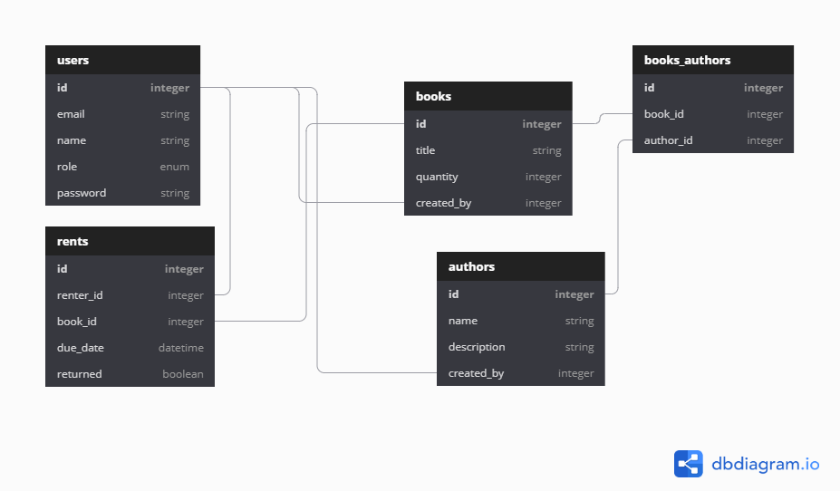

<figure>


  <figcaption>Photo by <a href="https://unsplash.com/@vinetlouispictures" target="_blank" rel="noopener noreferrer">Sophie Vinetlouis</a> on <a href="https://unsplash.com/" target="_blank" rel="noopener noreferrer">Unsplash</a></figcaption>
</figure>

Have you ever been struggling to make entity relationship (ER) diagrams, when you put your time more on the cosmetics rather than developing it? We were on the same page. Then one day, I found a tool that changed the game.

## Introducing dbdiagram.io

[dbdiagram.io](https://dbdiagram.io/home) allows us to create ER diagrams by code. Using database markup language (DBML)[^1], we as developers can define our database effortlessly because it feels like home. Provided by example, we can quickly jump in and grasp the concept. When we declare a table, it automatically creates one. The same thing happens when we put on the entity-relationship references.

<figure>

  <video autoplay loop muted playsinline>
    <source src="dbdiagram-demo.0791273.webm" type="video/webm">
    <source src="dbdiagram-demo.0791273.mp4" type="video/mp4">
  </video>

  <figcaption>How dbdiagram.io works (source: <a href="https://dbdiagram.io/home" target="_blank" rel="noopener noreferrer">dbdiagram.io</a>)</figcaption>
</figure>

This tool comes with a free tier. It has already provided essential elements such as save, share, export to SQL, and import. There's also "dark mode" for those who love the dimmed screen.

## Demo time

<figure>



  <figcaption>My book rent ER diagram</figcaption>
</figure>

The schema above was created by the following code:

```dbml
enum role {
  administrator
  user
}

Table users {
  id integer [pk]
  email string
  name string
  role enum [default: 'user']
  password string
}

Table books {
  id integer [pk]
  title string
  quantity integer
  created_by integer [ref: - users.id]
}

Table authors {
  id integer [pk]
  name string
  description string
  created_by integer [ref: - users.id]
}

Table books_authors {
  id integer [pk]
  book_id integer [ref: > books.id]
  author_id integer [ref: > authors.id]
}

Table rents {
  id integer [pk]
  renter_id integer [ref: > users.id]
  book_id integer [ref: > books.id]
  due_date datetime
  returned boolean
}
```

## Exporting as PostgreSQL

After the code is written, on the menu bar click "Export" and then "Export PostgreSQL". The SQL file will look like this:

```sql
CREATE TYPE "role" AS ENUM (
  'administrator',
  'user'
);

CREATE TABLE "users" (
  "id" integer PRIMARY KEY,
  "email" string,
  "name" string,
  "role" enum DEFAULT 'user',
  "password" string
);

CREATE TABLE "books" (
  "id" integer PRIMARY KEY,
  "title" string,
  "quantity" integer,
  "created_by" integer
);

CREATE TABLE "authors" (
  "id" integer PRIMARY KEY,
  "name" string,
  "description" string,
  "created_by" integer
);

CREATE TABLE "books_authors" (
  "id" integer PRIMARY KEY,
  "book_id" integer,
  "author_id" integer
);

CREATE TABLE "rents" (
  "id" integer PRIMARY KEY,
  "renter_id" integer,
  "book_id" integer,
  "due_date" datetime,
  "returned" boolean
);

ALTER TABLE "books" ADD FOREIGN KEY ("created_by") REFERENCES "users" ("id");

ALTER TABLE "authors" ADD FOREIGN KEY ("created_by") REFERENCES "users" ("id");

ALTER TABLE "books_authors" ADD FOREIGN KEY ("book_id") REFERENCES "books" ("id");

ALTER TABLE "books_authors" ADD FOREIGN KEY ("author_id") REFERENCES "authors" ("id");

ALTER TABLE "rents" ADD FOREIGN KEY ("renter_id") REFERENCES "users" ("id");

ALTER TABLE "rents" ADD FOREIGN KEY ("book_id") REFERENCES "books" ("id");
```

## There is room for improvement

Despite its convenience, it does not come with no flaws. The relation lines are a bit awkward and become tangled when it comes to complex diagrams. We have to move the tables to the right place because the "Auto-arrange" feature does not work well at this moment. No "bridge" on line intersection makes it a bit tricky to trace. Though, there's a workaround by hovering over a table to highlight its relations or enable the "Highlight" button. But overall, I would say this is a very useful tool, especially for back end developers!

_Originally published at [LinkedIn](https://www.linkedin.com/posts/fitrahtur-rahman_database-schema-sql-activity-6666215807799873536-jXMH) on May 13 2020_

[^1]: DBML, **_DBML - Database Markup Language_** \[website\], https://www.dbml.org/, (accessed June 7 2020)
