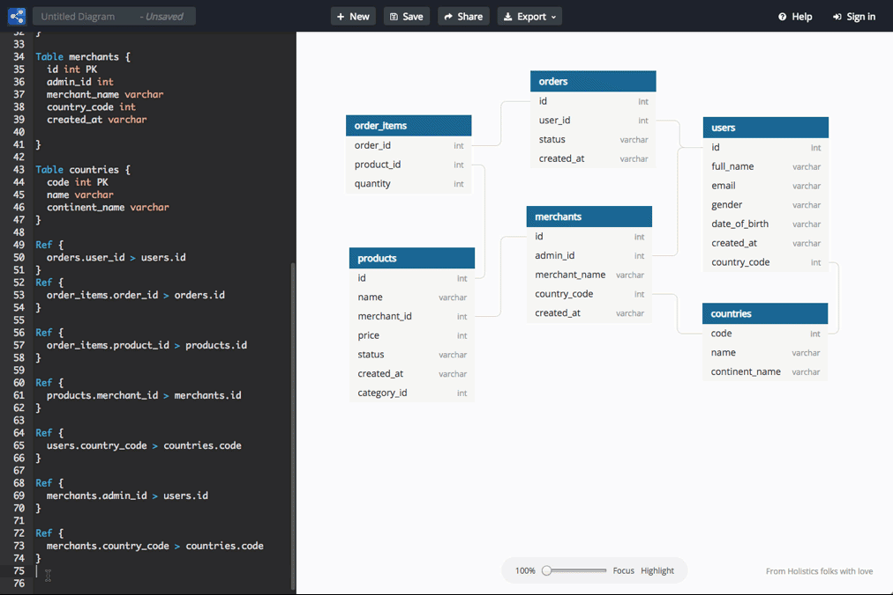
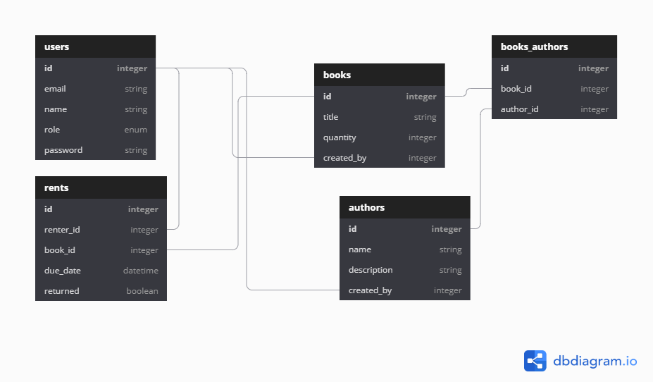

Have you ever been struggling to make entity relationship (ER) diagrams, when you put your time more on the cosmetics rather than developing it? We were on the same page. Then one day, I found a tool that changed the game.

## Introducing dbdiagram.io

[dbdiagram.io](https://dbdiagram.io/home) allows us to create ER diagrams by code. Using database markup language (DBML)[^1], we as developers can define our database effortlessly because it feels like home. Provided by example, we can quickly jump in and grasp the concept. When we declare a table, it automatically creates one. The same thing happens when we put on the entity-relationship references.

<figure>

  

  <figcaption>How dbdiagram.io works (source: <a href="https://dbdiagram.io/home target="_blank" rel="noopener noreferrer">dbdiagram.io</a>)</figcaption>
</figure>

This tool comes with a free tier. It has already provided essential elements such as save, share, export to SQL, and import. There's also "dark mode" for those who love the dimmed screen.

<figure>

  

  <figcaption>My book rent ER diagram</figcaption>
</figure>

It does not come with no flaws. The relation lines are a bit awkward and become tangled when it comes to complex diagrams. We have to move the tables to the right place because the "Auto-arrange" feature does not work well at this moment. No "bridge" on line intersection makes it a bit tricky to trace. Though, there's a workaround by hovering over a table to highlight its relations or enable the "Highlight" button. But overall, I would say this is a very useful tool, especially for back end developers!

*Originally published at [LinkedIn](https://www.linkedin.com/posts/fitrahtur-rahman_database-schema-sql-activity-6666215807799873536-jXMH) on May 13 2020*

[^1]: DBML, ***DBML - Database Markup Language*** \[website\], https://www.dbml.org/, (accessed June 7 2020)