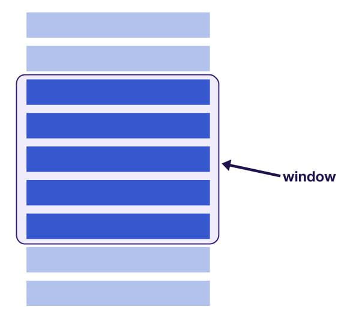

<figure>


  <figcaption>Photo by <a href="https://unsplash.com/@coriel" target="_blank" rel="noopener noreferrer">Caitlin Oriel</a> on <a href="https://unsplash.com/" target="_blank" rel="noopener noreferrer">Unsplash</a></figcaption>
</figure>

Smooth user interface has always been an important aspect of a web app, even a digital product in general. As the product grows, so does its data. Let's say we have a list of people on a page. Traditionally, we loop it with `map()` method like this:

```jsx
import React, from 'react';
import './App.css';

const people = [/* a list of users */]

const App = () => {
  return (
    <div style={{ height: "150px", width: "200px", overflowY: "auto" }}>
      {people.map((person, index) => (
        <div style={{ height: "35px", width: "100%" }} key={index}>
          {person.name}
        </div>
      ))}
    </div>
  );
}

export default App;
```

But what if there are a hundred of them? Or even a thousand? They would dramatically reduce our app's performance and causes a bottleneck. Rendering rows on the list utilizes CPU intensively and the worst case—your browser would choke it to death[^1]. A slow app would interrupt the user experience, of course. Lucky enough if the device can survive the heavy load. In order to keep users engaged, we have to avoid letting it happen.

## Conditional rendering with react-window

[react-window](https://github.com/bvaughn/react-window) is a package of React components capable of rendering a large list of data. You have probably heard of [react-virtualized](https://github.com/bvaughn/react-virtualized) by [Brian Vaughn](https://github.com/bvaughn). It has the same purpose—but he made `react-window` a complete rewrite, leaving only the core feature from its precursor. Thus, the package size is reduced from 35.1 kB to 6.2 kB (minified + gzipped)[^2].

## Usage

### FixedSizeList

If you know how much height you need for each row, import `FixedSizeList` component from `react-window`. Next, pass props as follows:

- `height`: our container height in pixel
- `width`: our container width in pixel
- `itemCount`: how many items we are going to render
- `itemSize`: height of each row in pixel

Suppose that we want to make a list of a thousand artists around the world. Consider the example below:

```jsx
// in your App.jsx
import React from "react"
import { FixedSizeList } from "react-window"

const artists = [
  /* your data */
]

const App = () => {
  const Row = ({ index, style }) => <div style={style}>{artists[index]}</div>

  return (
    <FixedSizeList
      height={150}
      width={300}
      itemCount={artists.length}
      itemSize={65}
    >
      {Row}
    </FixedSizeList>
  )
}

export default App
```

Inside the component, we add another component named `Row`. This child element inherits two props; `index` and `style`. Pass `style` prop into the element's own inline `style`. If you are curious what it contains, this is what it looks like from the third row:

```javascript
props: {
  index: 2,
  style: {
    position: "absolute",
    left: 0,
    top: 0,
    height: 130, /* itemSize × index */
    width:"100%"
  }
}
```

### Variable Size List

We have made a list of artists. How about giving the featured ones spotlight by making their row bigger? In this case, use `VariableSizeList`. All props are the same, except `itemSize`. It accepts a `function` with `index` passed as an argument that returns `number` eventually.

```jsx
// in your App.jsx
import React from "react"
import { VariableSizeList } from "react-window"

const artists = [
  {
    name: "Above & Beyond",
    featured: true,
  },
  {
    name: "Andrew Bayer",
    featured: false,
  },
  /* etc... */
]

const App = () => {
  const Row = ({ index, style }) => (
    <div style={style}>{artists[index].name}</div>
  )

  return (
    <VariableSizeList
      height={150}
      width={300}
      itemCount={artists.length}
      itemSize={index => (artists[index].featured ? 100 : 65)}
    >
      {Row}
    </VariableSizeList>
  )
}

export default App
```

### List with AutoSizer

If we already have a parent element as the container, `width` and `height` prop values can be set adaptively using [react-virtualized-auto-sizer](https://www.npmjs.com/package/react-virtualized-auto-sizer).

```jsx
// in your App.jsx
import React from "react"
import { FixedSizeList } from "react-window"
import AutoSizer from "react-virtualized-auto-sizer"

const artists = [
  /* your data */
]

const App = () => {
  const Row = ({ index, style }) => <div style={style}>{artists[index]}</div>

  return (
    <div
      style={{
        height: "200px",
        width: "300px",
      }}
    >
      <AutoSizer>
        {({ height, width }) => (
          <FixedSizeList
            height={height}
            width={width}
            itemCount={artists.length}
            itemSize={65}
          >
            {Row}
          </FixedSizeList>
        )}
      </AutoSizer>
    </div>
  )
}

export default App
```

### Horizontal list and grid

`react-window` also supports horizontal layout and grid for multidimensional list, allowing the user to scroll both vertically and horizontally. You can check out [react-window.now.sh](https://react-window.now.sh/) to see the example.

## Under the hood

<figure>



  <figcaption>Behind the scene of react-window (source: <a href="https://web.dev/virtualize-long-lists-react-window/">web.dev</a>)</figcaption>
</figure>

`react-window` implements a similar technique on 3D computer graphics called _Occlusion Culling_ that reveals objects only visible to the user and avoids unnecessary render[^3]. It has a container as tall as the sum of entire rows' height. Each row is `absolute`-ly positioned (pun intended) and its `top` property is responsible for conditional rendering. There's also _Frustum Culling_, a less strict one. However, both are important to keep user experience frictionless. Have a look at _Horizon Zero Dawn_ below.

<figure>

  <video autoplay loop muted playsinline>
    <source src="horizon-zero-dawn-culling.webm" type="video/webm">
    <source src="horizon-zero-dawn-culling.mp4" type="video/mp4">
  </video>

  <figcaption>Frustum Culling (source: <a href="https://youtu.be/A0eaGRcdwpo?t=1096" target="_blank" rel="noopener noreferrer"><i>Horizon Zero Dawn – The making of the game (2017)</i></a> at 18:16 mark)</figcaption>
</figure>

Nevertheless, keep in mind that this is not our Swiss-Army-knife for every list. If the number of rows is still reasonable, there is no need to over-engineer it.

[^1]: Stack Overflow, **_performance - Why is the rendering of HTML a cpu intensive process?_** \[website\] https://stackoverflow.com/questions/4778356/why-is-the-rendering-of-html-a-cpu-intensive-process, (accessed June 9 2020)
[^2]: BundlePhobia, **_react-virtualized@9.21.2_** \[website\], https://bundlephobia.com/result?p=react-virtualized@9.21.2, (accessed June 9 2020); BundlePhobia, **_react-window@1.8.5_** \[website\], https://bundlephobia.com/result?p=react-window@1.8.5, (accessed June 9 2020)
[^3]: Unity, **_Manual: Occlusion Culling_** \[website\], https://docs.unity3d.com/Manual/OcclusionCulling.html, (accessed June 9 2020)
