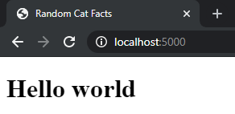
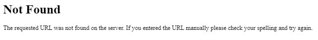
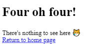
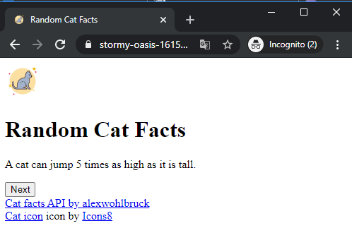
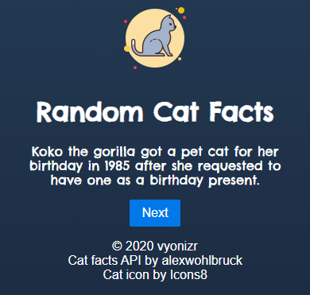

This post guides you through Flask, a micro web framework in Python. We may not hear it often among the rise of JAMstack, but big companies like Netflix and LinkedIn use it for their business[^1]. It is modular, minimalist, and provides detailed documentation. It is also covers both stacks: back-end and front-end with the support from secure Jinja2 templating engine[^2]. So I wanted to give it a try by building a simple app to generate cat facts.

### Prerequisites

Before we begin, it is recommended to have Python `3.5` or higher installed. Mine is `3.6.9` in this time of writing. It conveniently comes with `pip` package installer and `venv` module to create virtual environments. Basic git knowledge is also needed for creating Github repository.

## Installation

### Setting up virtual environment (venv)

In Python, it comes in handy if you have an isolated environment for different projects. Every project is using different packages and if you install it globally, your `requirements.txt` aka your "dependency list" will be bloated with unnecessary packages when shared with other collaborators.

1. `Flask` is the framework we are going to build our app upon
2. `flask-cors` to enable Cross-Origin Resource Sharing (CORS) in our app
3. `requests` to fetch external API
4. `gunicorn` to serve our web app on deployment

```bash
mkdir flask-cat-facts
cd flask-cat-facts

# create a virtual environment called "venv"
python3 -m venv venv

# activate "venv"
source venv/bin/activate

# install packages with pip
pip install Flask flask-cors requests gunicorn

# save your dependencies on requirements.txt
pip freeze | grep -v "pkg-resources" > requirements.txt
```

I did not include `pkg-resources` because it is a bug caused by incorrect metadata given by Ubuntu to `pip`[^3] and it would break our build on deployment. If you are on other operating system, use `pip freeze > requirements.txt` instead. By the end of the guide, your project directory would look like this:

```text
/flask-cat-facts/
├── flaskr/
│   ├── __init__.py
│   ├── static/
│   │   └── images /
│   │       └── icons8-cat-50.png
│   └── templates/
│       ├── 404.html
│       ├── index.html
│       └── layout.html
├── venv/
├── .gitignore
├── Procfile
├── README.md
└── requirements.txt
```

Download cat icon [here](https://icons8.com/icon/tgLepcPbp6mP/cat) and place it inside `images` directory. Next, Create a `.gitignore` file to exclude these files and directories:

```text
# in our .gitignore

venv/

*.pyc
__pycache__/

instance/

.pytest_cache/
.coverage
htmlcov/

dist/
build/
*.egg-info/
```


## Development

Create a file named `__init__.py` inside `flaskr` folder.

### Setting up web server

```python
# /flask-cat-facts/flaskr/__init__.py

from flask import Flask
from flask import render_template
from flask_cors import CORS

app = Flask(__name__)
CORS(app)

@app.route('/')
def main():
  return render_template('index.html')
```

1. `Flask(__name__)` creates an instance of Flask. `__name__` refers to the parent directory the file is in, which is `flaskr`.
2. As previously mentioned, `flask` has templating engine called Jinja. This is useful for rendering HTML pages
3. Invoke `CORS(app)` to enable CORS
4. Declare a route to the root and serve a page

### Creating layout

We are going to create more than one page and they have some parts in common. Rather than repeating the code, we can create a layout. Jinja is able to inherit reusable HTML codes.

```html
<!-- /flask-cat-facts/templates/layout.html -->

<!DOCTYPE html>
<html lang="en">
  <head>
    <meta charset="UTF-8">
    <meta http-equiv="Cache-Control" content="no-cache, no-store, must-revalidate" />
    <meta http-equiv="Pragma" content="no-cache" />
    <meta http-equiv="Expires" content="0" />
    <meta name="viewport" content="width=device-width, initial-scale=1.0">
    <meta name="description" content="Random cat facts">
    <link rel="icon" type="image/png" href="{{ url_for('static', filename='images/icons8-cat-50.png') }}">
    <title></title>
  </head>

  <body>
    <div>
      
    </div>
  </body>

  
</html>
```

> #### In plain English
>
> - Hello, I am `layout.html`. I've got a template for you HTMLs to work. You can fill in the `title`, `content`, and `script` section

```html
<link rel="icon" type="image/png" href="{{ url_for('static', filename='images/icons8-cat-50.png') }}">
```

As you can see, the syntax above is bit strange. But don't worry, because it is part of Jinja's work. It creates a path called `static` and set the file path on `filename` relative to `flaskr/static`[^5]. Importing CSS can be done in a similar fashion:

```html
<link rel="stylesheet" href="{{ url_for('static', filename='styles/global.css') }}">
```

Now create `index.html`. In order to use the layout, use ``

```html
<!-- /flask-cat-facts/templates/index.html CHILD TEMPLATE-->


Random Cat Facts

<h1>Hello world</h1>



```

### Run server

To see what we have done so far, use this command:

```bash
# load our flask app
export FLASK_APP=flaskr

# by default, flask is set to run in production environment
# set our flask app to be in development
export FLASK_ENV=development

# run app on port 5000 by default
flask run
```

<figure>



  <figcaption>our index.html</figcaption>
</figure>

### Displaying cat facts

The next thing is how we display the cat facts. There's an API by [alexwohlbruck](https://github.com/alexwohlbruck/cat-facts) to fetch from, so we don't have to build from scratch. Provide a new route in your server:

```python
# in our __init__.py

# your previous code here...

@app.route('/api/cats/')
def catFacts():
  resp = requests.get('https://cat-fact.herokuapp.com/facts/random?animal_type=cat&amount=1')
  return json.loads(resp.text)
```

Apply this to your `index.html`:

```html
<!-- /flask-cat-facts/templates/index.html -->


Random Cat Facts


<h1>Random Cat Facts</h1>
<p id="cat-fact"></p>
<button id="next-button" onclick="fetchCatFact()">Next</button>
<br />
<a href="https://github.com/alexwohlbruck/cat-facts" class="no-decoration" target="_blank" rel="noopener">Cat facts API by alexwohlbruck</a>
<br />
<a target="_blank" href="https://icons8.com/icons/set/cat">Cat icon</a> icon by <a target="_blank" href="https://icons8.com">Icons8</a>



<script>
  const baseURL = window.location.href
  const catFactP = document.getElementById("cat-fact")
  const nextButton = document.getElementById("next-button")

  const fetchCatFact = async () => {
    try {
      catFactP.innerHTML = "Loading..."
      nextButton.disabled = true

      const response = await fetch(`${baseURL}api/cats/`)
      const json = await response.json()

      catFactP.innerHTML = json.text
      nextButton.disabled = false
    }
    catch {
      catFactP.innerHTML = "Ouch! Something went wrong. Please reload the page."
    }
  }

  fetchCatFact()
</script>

```

And now we can get facts data, one at a time! We use `async await` method and a bit of DOM manipulation to display the fact and toggle disable state on `Next` button.

> #### In plain English
> `p`, please stand by while `fetch` is fetching the cat fact information. `fetch`, once you get it, pass to `p` to display. Tell `button` to make itself unclickable until `p` displays something other than `Loading...`. And `p`, if we fail, please display _"Ouch! Something went wrong. Please reload the page."_

### Handle "not found" page

Try opening `http://localhost:5000/johndoe`. You'll get an error message like this:

<figure>



  <figcaption>Unhandled 404 page</figcaption>
</figure>

However, the language is a bit technical. We have to make it casual to the user.

```python
# in our __init__.py

# your previous code here...

@app.errorhandler(404)
def page_not_found(error):
  return render_template('404.html'), 404
```

```html
<!-- /flask-cat-facts/templates/404.html -->


Page not found

<h1>Four oh four!</h1>
<p>There's nothing to see here 😿<br><a href="/">Return to home page</a></p>

```

Now, try opening `http://localhost:5000/johndoe` again.

<figure>



  <figcaption>Handled 404 page</figcaption>
</figure>

## Deploying the app with Heroku

Almost there to have our web app published. Unfortunately, Flask is not designed for production environment and cannot effectively handle multiple requests. _But_, previously, we have installed [Green Unicorn](https://github.com/benoitc/gunicorn) (`gunicorn`). This is the answer of what Flask lacks of. `gunicorn` is a Python WSGI HTTP Server that establishes communication between web server and our Python app.

 Visit [Heroku CLI page](https://devcenter.heroku.com/articles/heroku-cli) if you haven't installed CLI before. Then, create an extensionless file named `Procfile` in the **root** of our project and add this command to order Heroku what to execute on startup:

```text
# in your Procfile

web: gunicorn flaskr:app
```

> #### In plain English
> `Procfile`, please run `web` process using `gunicorn` that points out to an `app` named `flaskr`

After that, we wrap all the files into a commit and deploy it:

```bash
# commit our work
git add .
git commit -m "initial commit"

# login to Heroku
heroku login

# generate new Heroku app
# by default, it automatically adds a git remote named “heroku”
# you would also get an URL to your app with this pattern:
# https://<your app name>.herokuapp.com/
heroku create

# push our work to master branch of "heroku" git remote
git push heroku master
```

You can visit the link provided by `heroku create` command before. Or if you don't remember, you can visit your [Heroku dashboard](https://dashboard.heroku.com/apps).

<figure>



  <figcaption>Your site is now live! 🥳</figcaption>
</figure>

Add some styling with CSS to make it fancy:

<figure>



  <figcaption><a href="https://vyonizr-cat-facts.herokuapp.com/" target="_blank" rel="noopener noreferrer">vyonizr-cat-facts.herokuapp.com</a></figcaption>
</figure>

And you're done! 🎉 You can check out my repository on [github](https://github.com/vyonizr/flask-cat-facts).

[^1]: Github, **_List of companies using Flask framework_** \[website\], https://github.com/rochacbruno/flask-powered, (accessed June 14 2020)
[^2]: Jinja features automatic HTML escaping to prevent cross-site scripting (XSS) attacks; Wikipedia, **_Jinja (template engine)_** \[website\], https://en.wikipedia.org/wiki/Jinja_(template_engine), (accessed June 14 2020)
[^3]: Stack Overflow, **_python - What is "pkg-resources==0.0.0" in output of pip freeze command_** \[website\], https://stackoverflow.com/questions/39577984/what-is-pkg-resources-0-0-0-in-output-of-pip-freeze-command , (accessed June 14 2020)
[^5]: Flask Documentation (1.1.x), **_Static Files_** \[website\], https://flask.palletsprojects.com/en/1.1.x/tutorial/static, (accessed June 20 2020)
[^6]: vsupalov.com, **_Flask Is Not Your Production Server_** \[website\], https://vsupalov.com/flask-web-server-in-production/, (accessed June 21 2020)