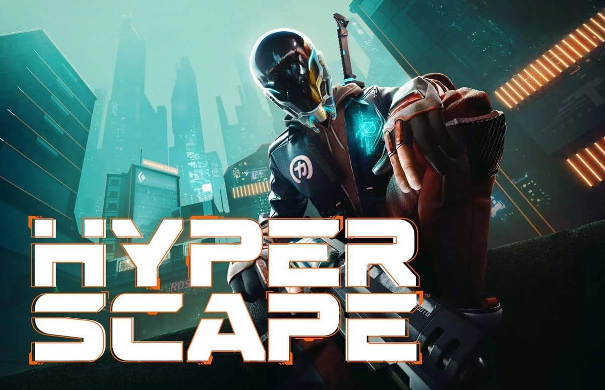

<figure>

  <figcaption>Hyper Scape</figcaption>
</figure>

Ubisoft finally joined the battle royale bandwagon after four years since the phenomenon dawned. Developed by Ubisoft Montreal, it's free and currently around 8.8 GB only, which is very small compared to the other titles. Maybe because it is still in beta and not much being added yet. Taking a place in a fictional city called *Neo Arcadia*, a player wins by holding the crown for 45 seconds or be the last man standing among 99 opponents.

There are two kinds of items; Weapons and special abilities called *Hacks* . Both have two slots. Before you jump into a match, you can try them all in the lobby against dummy targets to get used to.

<figure>

  <video autoplay loop muted playsinline>
    <source src="testing-ground.webm" type="video/webm">
    <source src="testing-ground.mp4" type="video/mp4">
  </video>

  <figcaption>Testing ground</figcaption>
</figure>

When you've joined, you are gathered on a floating platform. The waiting time until deployment is a bit long. I think it should be started once the number of players reaches 90. Instead of jumping off from an airplane or flying bus, you ride a pod to pick your starting point. You will never get hurt from falling from a height. Once you land, you loot just like other BRs. Doors and windows are barricaded by orange panels and meant to be broken.

<figure>

  <video autoplay loop muted playsinline>
    <source src="deployment.webm" type="video/webm">
    <source src="deployment.mp4" type="video/mp4">
  </video>

  <figcaption>Deployment</figcaption>
</figure>

If you find an item you already own, you can fuse it to increase damage or reduce cooldown time. My favorite weapon so far is *Hexfire* (gatling gun) and *Ripper* (assault rifle) as with both I can handle short and long-range battles (even though I always lose in the end most of the times). For *Hacks*, I choose invisibility and shield. Sometimes you have to know when you have to fight or flight. Invisibility lets me get out of enemy sight and find a safe place or even ambush them. When in a fight, shield helps me to absorb the damage from the opponent for a short time.

<figure>

  <video autoplay loop muted playsinline>
    <source src="upgrade.webm" type="video/webm">
    <source src="upgrade.mp4" type="video/mp4">
  </video>

  <figcaption>Skill & weapon fusion</figcaption>
</figure>

The map doesn't shrink traditionally in a circular area. Instead, it nonlinearly corrupts the outermost region—slowly turns into dark blue and drains your health once it's fully "collapsed". No medkits here, but you can recover after a while.

<figure>

  <video autoplay loop muted playsinline>
    <source src="closing_sector.webm" type="video/webm">
    <source src="closing_sector.mp4" type="video/mp4">
  </video>

  <figcaption><i>Sector is collapsing. Run for your life!</i></figcaption>
</figure>

You can either play solo or trio. On trio, dead teammates aren’t really dead. They become *Echo* and remain invisible until you revive them at a restore point spread across the map or by eliminating another team. *Echo* can tag opponents too, which is nice. The movement is fast and fluid. It automatically climbs when you're close to a ledge. The gameplay is straightforward and easy to pick up. Voice actors are a bit dull and rather annoying. But overall, it is still enjoyable.

Download Hyper Scape [here](https://www.ubisoft.com/en-gb/game/hyper-scape)